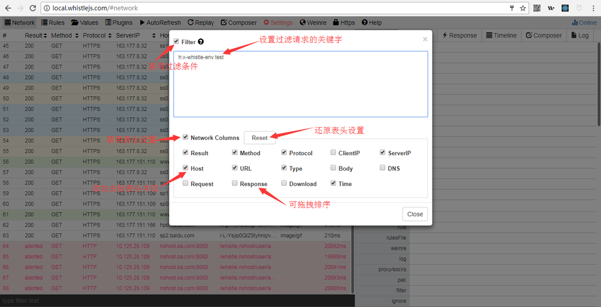

# Settings

在whistle的界面中，分别有 **Network**、**Rules**、**Values**三个页面有 **Settings** 菜单，其中，**Rules** 和 **Values** 的 **Settings** 主要用于设置编辑器样式及是否允许多选Rules，具体分别参见：[Rules界面说明](rules.html) 和 [Values界面说明](rules.html)。

#### Network

1. Filter：用来设置过滤请求的关键字，Networt的Settings按钮上的Filter和请求列表下方的Filter的区别是，前者会把不匹配的请求直接过滤掉，无法再找回来，而后后者只是把列表中的Dom节点隐藏了，且Settings按钮上的Filter功能更强大，可以同时匹配url、请求响应头、请求方法、响应状态码、ClientIP及ServerIP、请求响应内容(以上匹配都不区分大小写)。

	Filter:

		test1 test2 test2
		key1 key2 key3
		h:head1 heade2 head3
		h: h1 h2
		s: 200
		i: 100 88
		i: 11 77
		m: get
		b: keyword1 keyword2
		b: keyword3

	`h:`、`s:`、`i:`、`m:`、`b:`分别表示匹配请求响应头、请求方法、响应状态码、ClientIP及ServerIP、请求响应内容、其它表示匹配url(以上匹配都不区分大小写)，同一行内容多个匹配用空格隔开，最多支持3个，表示对应的内容要同时匹配这三个关键字，不同行表示或的关系

2. Network Columns：主要用于设置Network表头，或者拖拽重排等

